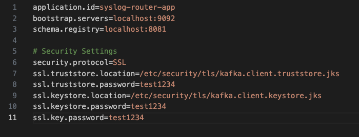
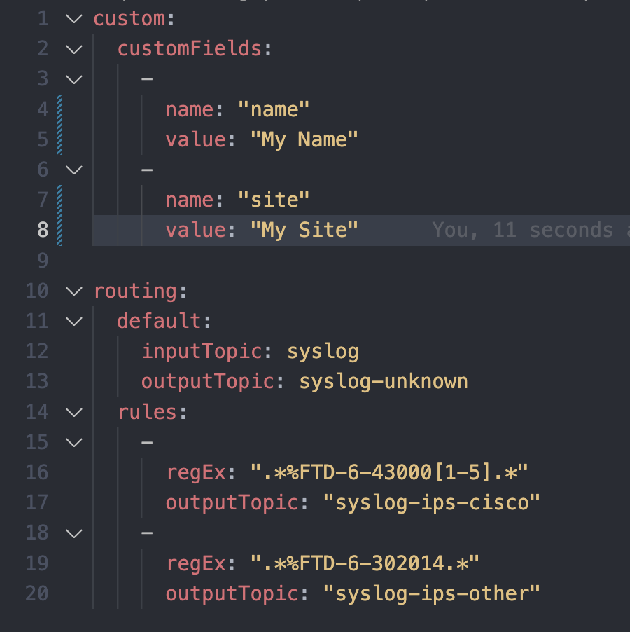

# Getting Started

The kstreamsrouter application is a Kafka Streams application that take an input topic from the 
Confluent Syslog Connector and routes the data to sub-topics based on a set of regex rules.
Additionally, you have the option to add any custom fields to the routed topic data.

There are two configuration files that need to be updated for your environment: `application.yaml`
and `routingconfig.yaml`. Both files are located in the `config` directory.

### Application Configuration
The `application.yaml` file contains all the properties specific to the application including input
topic, security settings, and logging.



The following fields should be modified for your environment:
* line 5 `dynamicRouteSyslogMessages-in-0` - input syslog topic
* lines 18-26 - security settings
* line 27 `broker` - list of comma separated Confluent brokers
* line 35 - logging level

### Routing Configuration
The `routingconfig.yaml` file contains a list of custom fields and a list of regex patterns. The 
custom fields are optional and contain a list of name/value pairs that will be added to the
output topic. If you do not want to include any custom fields, this section of the configuration
file can be removed.

The routing section contains a default output topic and a list of regex pattern and specific 
output topic when a match is found.



#### Custom Fields
Items within the list are separated by the dash (`-`) symbol. To add a new custom field, add a 
`-` followed by a name/value pairing. Example:

```
-
    name: "myNewField"
    value: "myNewValue"
```

#### Routing
The routing works by applying a regex pattern to the topic. When a match is found, the data will get
routed to the output topic defined in `outputTopic`. If no match is found, the data will get routed 
to the default topic defined in `default.topic`. You can change the value of `default.topic` (line
12 in the sample config) to anything you want.

Items within the list are separated by the dash (`-`) symbol. To add a new regex pattern, add a
`-` followed by a regex value and the output topic. Example:

```
-
    regEx: ".*%ASA.*"
    outputTopic: "rcc.log.ciscoasa.out"
```

### Running the Application
There is a script called `kstreams-router.sh` that will launch the Kafka Streams application. It is
configured to read the configuration files in the `config` directory. To run the application:

````
./kstreams-router.sh
````

***Note: if you are running the script from a remote directory, you may need to update the 
`SPRING_CONFIG_LOCATION` variable in the script to give the absolute path (i.e. replace `$PWD`).***